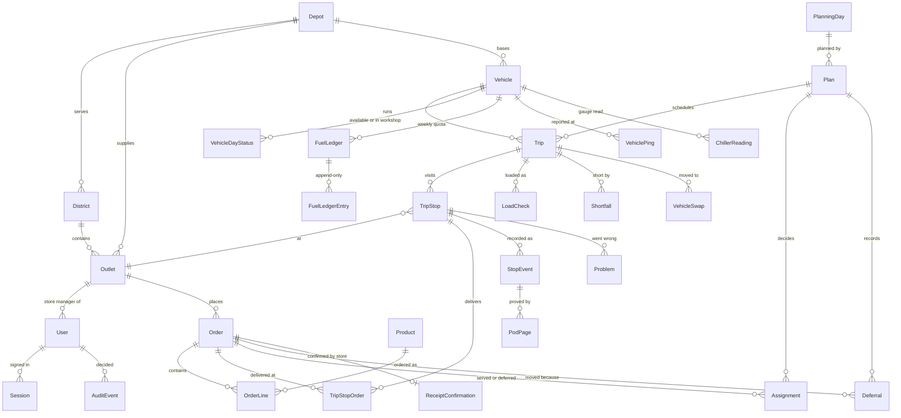

# Data model

PostgreSQL 17 through Prisma. The schema is split by area in
[apps/api/prisma/schema/](../apps/api/prisma/schema/). Only `apps/api` can
reach the database. The web and mobile clients read and write through the
HTTP API alone (see [ARCHITECTURE.md](ARCHITECTURE.md)).

| File | Holds |
|---|---|
| `base.prisma` | generator, datasource, schema-wide conventions |
| `enums.prisma` | every enum (brands, temperatures, statuses, reason kinds) |
| `identity.prisma` | users, sessions, login throttle, audit log, notifications |
| `reference.prisma` | depots, districts, outlets, vehicles, calendar, traffic, demand history, forecast, road-leg cache |
| `planning.prisma` | planning days, orders, products, order lines, plans, trips, stops, assignments, deferrals |
| `execution.prisma` | load checks, shortfalls, vehicle swaps, stop events, problems, receipts, dock notes |
| `ledger.prisma` | fuel ledger, capacity actions, sync log, seed metadata |
| `telemetry.prisma` | vehicle pings, chiller readings, proof-of-delivery pages |

## Conventions

- **Clock times are `"HH:MM"` strings and days are `@db.Date`**, never a
  `DateTime`, for anything that is only a wall-clock time or only a day. The
  competition data has no time zone, and every rule in the brief is in
  Asia/Colombo minutes. Converting would add information the data does not
  contain. Real instants (when a record was made, when a session expires) are
  `DateTime`.
- **Nothing that a decision points at is deleted.** Users, products and
  vehicles are deactivated or marked unavailable. Audit events, order lines and
  trips keep pointing at them.
- **Client-minted IDs make retries safe.** Order placement, load checks,
  pings and chiller readings carry a unique `client…Id`. A `StopEvent`'s
  primary key *is* the driver app's ULID. Replaying an offline outbox therefore
  cannot record anything twice.
- **Some unique indexes enforce business rules** (listed below), so the
  database refuses an invalid state even if application code has a bug.

## Core entities

## How one delivery moves through the tables

1. **Order.** A store manager places an `Order` for an outlet and a requested
   day. If it was built from the catalogue it also has `OrderLine`s (SKU, name,
   unit and size, copied at placement so a later product edit never rewrites a
   past order). Planning, loading and delivery are counted in the order's
   `units`, `weightKg` and `volumeM3`.
2. **Close the queue.** The dispatcher closes the `PlanningDay` (one per depot
   per day). Its `queueSnapshot` freezes what was in the queue.
3. **Plan.** Auto-plan writes a `Plan` (`DRAFT`) with `Trip`s (vehicle, trip 1
   or 2, brand, district, wave, road route and minutes), each with ordered
   `TripStop`s. Every order in the queue gets exactly one `Assignment`:
   `SERVED` (linked to a stop) or `DEFERRED`, with the allocator's machine
   explanation in `explanation`.
4. **Defer with a reason.** The dispatcher gives each deferred assignment a
   reason code (and optionally a note). On publish these become `Deferral` rows
   with `rolledToDate` and `storeNotifiedAt`, and the store gets a
   `Notification`.
5. **Publish.** The plan becomes `PUBLISHED` and the day's fleet is locked.
   Before that, re-running auto-plan replaces the draft (and any reasons
   already chosen on it).
6. **Load.** At the dock, `LoadProgress` holds a count in progress, and a
   `LoadCheck` records the final count per order on a trip. A short or damaged
   load raises a `Shortfall` that blocks departure (`blocksDeparture`) until
   the dispatcher resolves it (send short, hold, move to trip 2, cancel line).
   If the dispatcher moves a trip onto another vehicle mid-load, a
   `VehicleSwap` records the steps the loader works through.
7. **Deliver.** The driver's phone records `StopEvent`s (arrived, unloading,
   delivered, part-delivered, failed) with `PodPage`s as proof of delivery.
   Events from the offline outbox are marked `source = OUTBOX`. If the stop
   moved to another vehicle while the phone was offline, the event is marked
   with a `conflictState` instead of being applied silently. A `Problem` records
   a failed or obstructed stop.
8. **Receive.** The store manager writes a `ReceiptConfirmation`: units
   received, whether they match, and any issue.

Every decision on the way (closing, planning, deferring, publishing, resolving,
swapping, disabling an account) also writes an `AuditEvent` with who did it,
their role, the reason code, the note, and the record before and after.

## Lifecycles

| Entity | States |
|---|---|
| `PlanningDay` | `OPEN` → `CLOSED` → `PLANNING` → `PUBLISHED` |
| `Order` | `PLACED` → `QUEUED` → `PLANNED` → `LOADED` → `IN_TRANSIT` → `DELIVERED` / `PART_DELIVERED` / `FAILED`; or `DEFERRED` / `CANCELLED` |
| `Plan` | `DRAFT` → `PUBLISHED` (`SUPERSEDED` is reserved in the enum and not yet written) |
| `Trip` | `PLANNED` → `LOADING` → `READY` → `DEPARTED` → `COMPLETED`; or `CANCELLED` |
| `TripStop` | `PENDING` → `ARRIVED` → `UNLOADING` → `DONE`; or `SKIPPED` / `FAILED` |
| `Shortfall` | `OPEN` → `RESOLVED` |
| `Problem` | `NEW` → `ACKNOWLEDGED` → `RESOLVED` |
| `CapacityAction` | `PROPOSED` → `APPROVED` → `APPLIED`; or `REJECTED` |

[DOMAIN.md](DOMAIN.md) defines each status and reason code in operational
terms.

## Rules the database enforces

| Constraint | Rule |
|---|---|
| `Order @@unique([ref, requestedDate])` | one decision per order per day |
| `Assignment @@unique([planId, orderId])` | every order is decided exactly once per plan, served or deferred, which maps 1:1 to a line of the submission CSV |
| `Trip @@unique([planId, vehicleId, tripNo])` | a vehicle runs at most two trips a day (brief rule 7) |
| `PlanningDay @@unique([date, depotCode])` | one queue per depot per day |
| `TripStop @@unique([tripId, seq])` | a stop sequence has no gaps or duplicates |
| `StopEvent.id` = client ULID | an offline replay is idempotent by construction |
| `FuelLedger @@unique([vehicleId, isoYear, isoWeek])` | one weekly quota per vehicle; entries are append-only |

## Supporting tables

- **Reference data from the competition CSVs:** `District` (merged with
  district travel times), `ServiceAllowance` (handling minutes by brand and
  dock type), `CalendarDay` (operating days, holidays, festivals, monsoon),
  `TrafficSpeed`, `RoadCondition`, `HistoricalLeg`, `ServiceObservation`.
- **Demand and forecasting:** `WeeklyDemandHistory`, `DailyDemandHistory` and
  `DemandForecast` (mirrors the Task 2a submission, depot × brand × ISO week).
  `CapacityAction` turns a forecast deficit into a decision the dispatcher
  approves or rejects.
- **Fleet:** `VehicleDayStatus` is the editable "in workshop" switch for one
  vehicle on one day. It replaced a read-only CSV so the control is real.
  `FuelLedger` and `FuelLedgerEntry` hold the weekly fuel quota as an auditable
  sum of entries.
- **Routing:** `RoadLeg` caches road distance and time between two coordinate
  pairs, from OSRM or a straight-line estimate (`source`), so the same plan
  gives the same figures until the road data is refreshed.
- **Field reports, not sensor streams:** `VehiclePing` is the last position a
  driver's phone sent, aged by the device clock (`recordedAt`).
  `ChillerReading` is a person's reading of a gauge, with the target band
  copied onto the row.
- **Accounts:** `User` has a role, an email and password, and a Waypoint staff
  ID and PIN (what every sign-in screen asks for). It is scoped to a depot or
  an outlet. `Session` is an opaque 30-day cookie token, so a driver stays
  signed in through an offline stretch. `LoginThrottle` stores only hashed
  keys.
- **Operations:** `DockNote` (one shift handover note per dock per day),
  `SyncLog` (outbox batch sizes, duplicates, conflicts, clock skew), and
  `SeedMeta` (seed idempotency, which re-seeds automatically when the data
  source changes).
